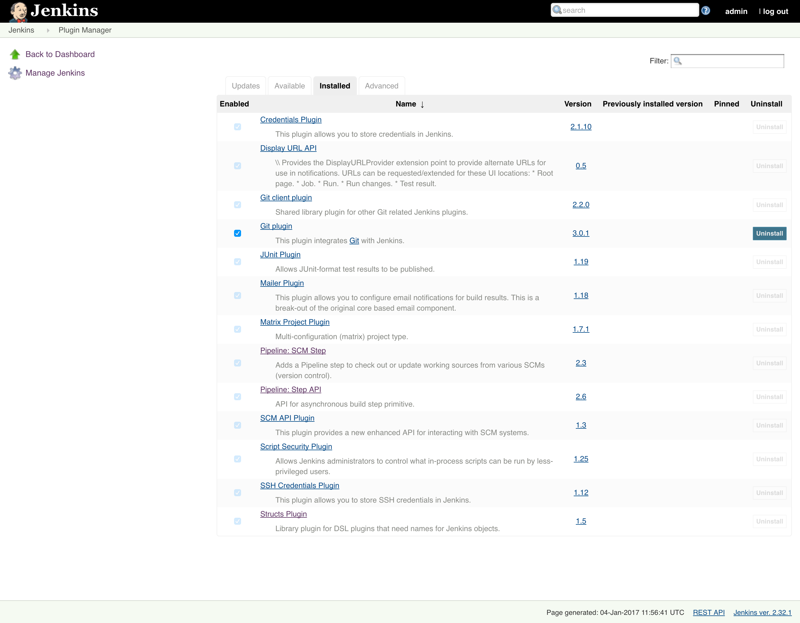

# installJenkinsPlugin
====================
This script allows you to install a Jenkins plugin on the local Jenkins node with all dependencies that are needed.

## Usage
========
Usage is very simple

```
	installPlugin.sh <PLUGINNAME>
```
## Example
==========
```
root@219cef5afee2:/var/jenkins_home# ./installPlugin.sh git
Installing git plugin ...
######################################################################## 100.0%
Found 7 dependencies for git.
Installing workflow-scm-step dependency for git
######################################################################## 100.0%
Found 1 dependencies for workflow-scm-step.
Installing workflow-step-api dependency for workflow-scm-step
######################################################################## 100.0%
Found 1 dependencies for workflow-step-api.
Installing structs dependency for workflow-step-api
######################################################################## 100.0%
Installing credentials dependency for git
######################################################################## 100.0%
Installing git-client dependency for git
######################################################################## 100.0%
Found 2 dependencies for git-client.
Installing ssh-credentials dependency for git-client
######################################################################## 100.0%
Found 1 dependencies for ssh-credentials.
Dependency credentials already installed.
Dependency structs already installed.
Installing mailer dependency for git
######################################################################## 100.0%
Found 1 dependencies for mailer.
Installing display-url-api dependency for mailer
######################################################################## 100.0%
Found 1 dependencies for display-url-api.
Installing junit dependency for display-url-api
######################################################################## 100.0%
Found 1 dependencies for junit.
Dependency structs already installed.
Installing matrix-project dependency for git
######################################################################## 100.0%
Found 2 dependencies for matrix-project.
Dependency junit already installed.
Installing script-security dependency for matrix-project
######################################################################## 100.0%
Installing scm-api dependency for git
######################################################################## 100.0%
Dependency ssh-credentials already installed.
Plugins and dependencies installed. Please DO NOT forget to restart Jenkins!
```
# Screenshot within Jenkins
===========================

